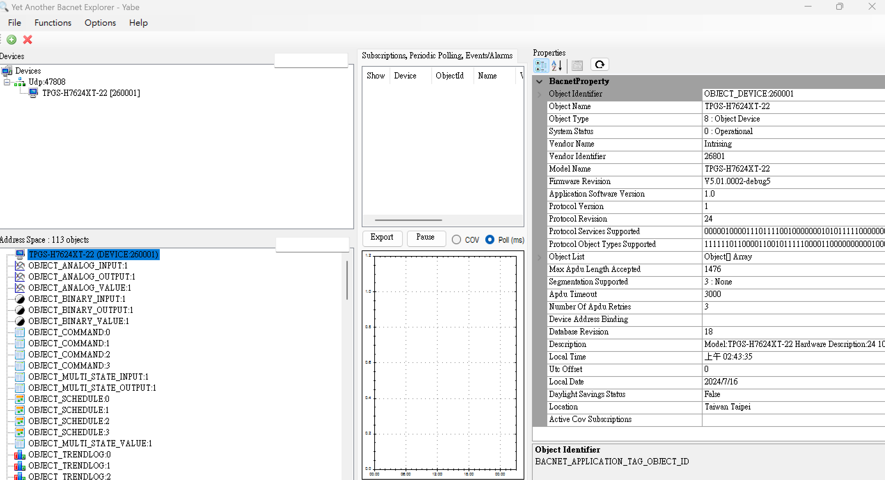
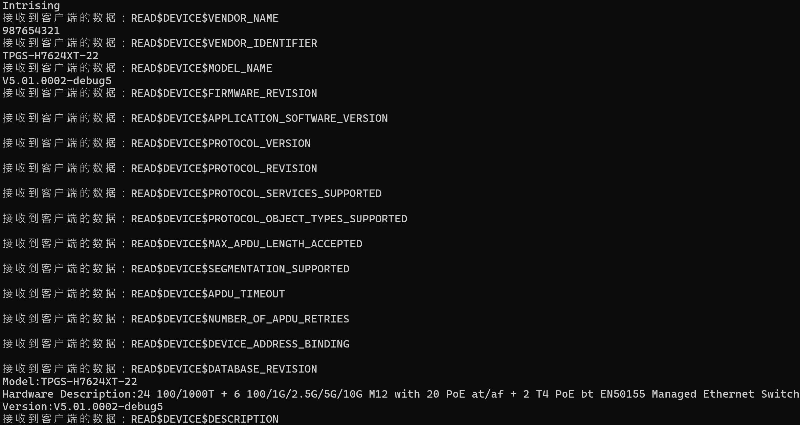

# BACnet Stack 

Source
----------------------

https://github.com/bacnet-stack/bacnet-stack

Build
------------------

* Linux : ```make bacserv```
* OS5 : ```./intri-build.sh```

Run
------------------

    $ ./bin/bacserv [id]

Demo with intri-automation
---------------------

client tool: https://sourceforge.net/projects/yetanotherbacnetexplorer/



intri-automation


